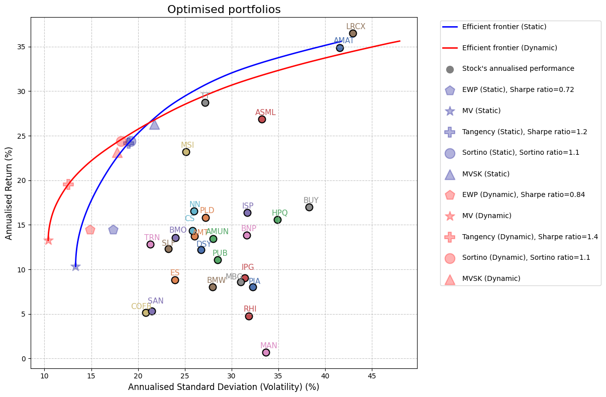
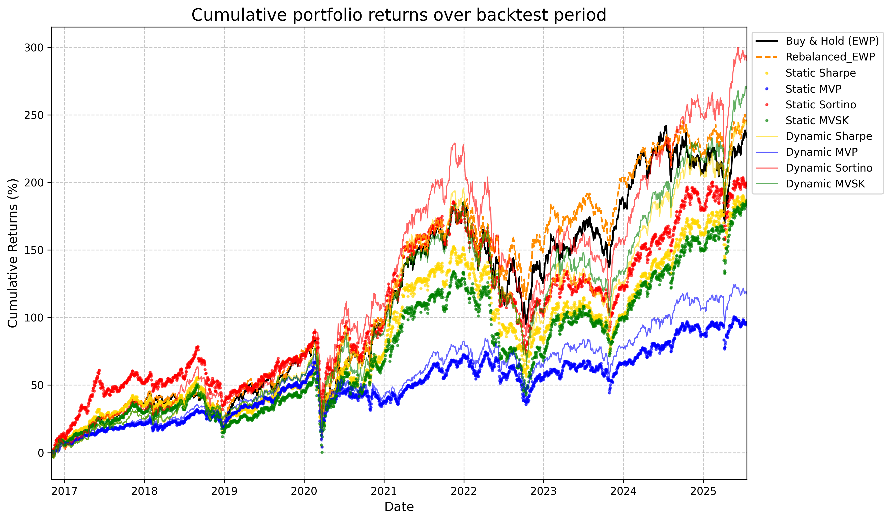
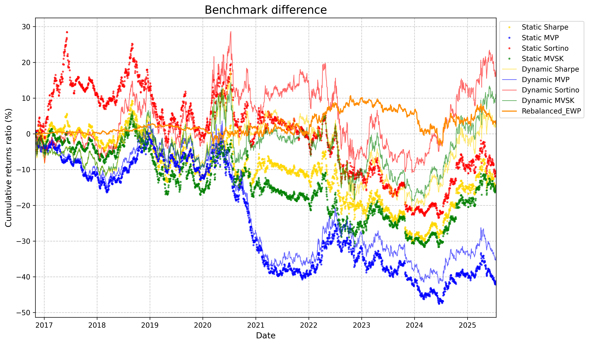
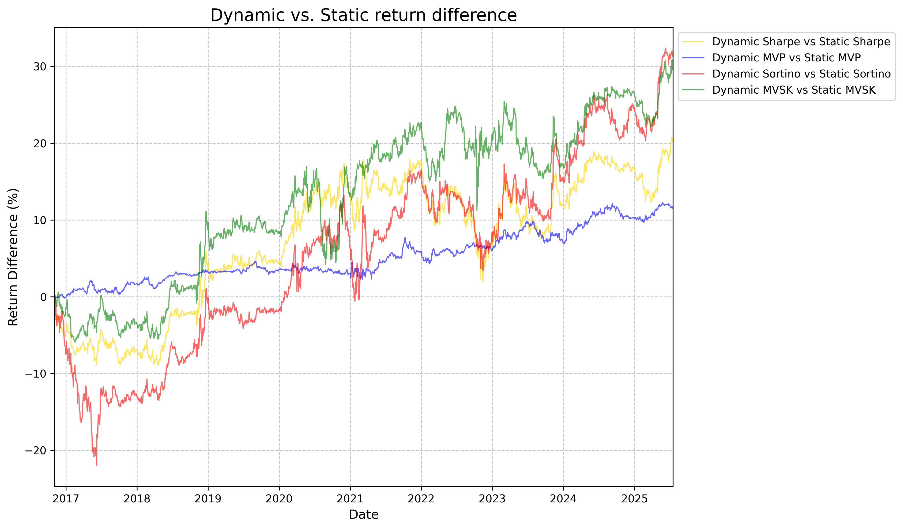

 


# Portfolio optimiser

A portfolio optimisation framework implementing modern portfolio theory with practical constraints and multiple optimisation strategies. Built for research and educational purposes in quantitative finance.

## Table of Contents
- [Overview](#overview)
- [Mathematical Foundation](#mathematical-foundation)
- [Quick Start](#quick-start)
- [Configuration](#configuration)
- [Output](#output)
- [Technical Implementation](#technical-implementation)
- [In Development](#in-development)
- [Academic References](#academic-references)
- [Contact](#contact)
- [Disclaimer](#disclaimer)
- [License](#license)

## Overview

This Python application optimises investment portfolios using historical stock data, supporting both static and dynamic covariance models with practical constraints such as position limits and sector diversification requirements.

**Key Features:**
- Multiple optimisation strategies (Minimum Variance, Maximum Sharpe, Sortino, MVSK)
- Dynamic covariance estimation with rolling windows
- Monte Carlo simulation for portfolio space exploration
- Multi-currency support with automatic FX conversion
- Sector and individual position constraints
- Comprehensive visualisation including efficient frontiers, correlation heatmap, cumulative return, benchmark difference, dynamic vs static strategy difference

## Mathematical Foundation

The optimiser implements several portfolio optimisation models:

- **Mean-Variance optimisation**: Classic Markowitz framework
- **Maximum Sharpe Ratio**: Tangency portfolio on the efficient frontier
- **Sortino Ratio**: Downside risk-adjusted optimisation
- **MVSK**: Mean-Variance-Skewness-Kurtosis utility maximisation

All optimisation models incorporate two optional diversification constraints: capped individual positions at X% of total portfolio value, and capped sector allocations at Y% maximum. The efficient frontier is computed only when these constraints can be satisfied simultaneously. Portfolios with insufficient assets to meet minimum diversification requirements will not generate frontier plots. This typically requires a minimum of 20 stocks if individual position limits are set to 5%.

## Quick Start

### Prerequisites
Tested with Python **3.12+**

```bash
pip install pandas numpy scipy matplotlib seaborn adjustText yfinance datetime
```

### Data Structure
The project expects a specific data structure if you're providing your own CSV files. Otherwise, data is fetched automatically from Yahoo Finance.
```
./
├── portfolio_optimiser_v1.1.py
├── config.json
├── utils.py
├── test_backtest.py
├── yahoo_cache/
│   └── yahoo_finance_data_YYYY-MM-DD_to_YYYY-MM-DD.csv
└── Stocks_Data/
    ├── USD/
    │   ├── AMAT.csv
    │   └── AMT.csv
    ├── EUR/
    │   ├── BNP.csv
    │   └── BMW.csv
    └── usdeur.csv
```

### CSV Format Requirements (Optional)

This section is for users who wish to import their own historical data instead of using the Yahoo Finance API (default).

Data should have a formatting similar to CSV files from:
- **US Stocks**: nasdaq.com historical data format - [Nasdaq Historical Data](https://www.nasdaq.com/market-activity/stocks)
- **EUR Stocks**: fr.investing.com historical data format - [Investing Historical Data](https://fr.investing.com/equities/)
- **FX rates**: EUR/USD exchange rates from fr.investing.com - [Investing.com EUR/USD](https://fr.investing.com/currencies/usd-eur-historical-data)

Expected columns:

- **Date column**: Consistent date format (MM/DD/YYYY for USD, DD/MM/YYYY for EUR). More specifically, the code uses format='%d/%m/%Y' for EUR if decimal_separator is a comma (,) and relies on errors='coerce' otherwise.
- **Price column**: 'Close/Last' (USD), 'Dernier' (EUR)
- **FX data**: EUR/USD exchange rates with 'Date' and 'Dernier' columns

Example:
| Field | USD Stocks | EUR Stocks | FX Data |
|-------|------------|------------|---------|
| Date  | `Date` (MM/DD/YYYY) | `Date` (DD/MM/YYYY) | `Date` |
| Price | `Close/Last` | `Dernier` | `Dernier` |
| Notes | Use U.S. locale (.) | Use French locale (,) | Use French locale (,) |

## Running the Application

There are two primary ways to run the Portfolio Optimiser:

### 1. Running the Executable
For a quick start without needing a Python environment setup, you can download the pre-compiled executable.

- Go to [Releases page](https://github.com/EFrion/PortfolioOptimiser/releases/tag/v1.1) and download the executable
- Ensure config.json, utils.py, and other necessary files are placed in the same directory as the extracted executable
- Run the executable

### 2. Running from Source (Python Script)

If you prefer to run the Python script directly, or wish to modify the code, follow these steps:

- Clone the repository or download the source code
- Ensure you have met the Prerequisites (Python and required libraries)
- Prepare your data as described in Data Structure and CSV Format Requirements (Optional)
- Go to the project's root directory in your terminal and execute the script:
```bash
python portfolio_optimiser_v1.1.py
```

## Configuration

The `config.json` file controls all optimisation parameters:

```json
{
  "feature_toggles": {
    "RUN_STATIC_PORTFOLIO": true,
    "RUN_DYNAMIC_PORTFOLIO": true,
    "RUN_EQUAL_WEIGHTED_PORTFOLIO": true,
    "RUN_MONTE_CARLO_SIMULATION": false,
    "RUN_MVO_OPTIMISATION": false,
    "RUN_SHARPE_OPTIMISATION": true,
    "RUN_SORTINO_OPTIMISATION": true,
    "RUN_MVSK_OPTIMISATION": true,
    "RUN_BACKTEST": true
  },
  "data_source": {
    "USE_YAHOO_FINANCE": true,
    "YAHOO_FINANCE_TICKERS": ["AMAT", "BNP.PA"],
    "YAHOO_START_DATE": "2015-11-01",
    "YAHOO_FINANCE_CACHE_DIR": "yahoo_cache"
  },
  "data_paths": {
    "STOCK_ROOT_FOLDER": "Stocks_Data",
    "EXCHANGE_RATE_FILE_NAME": "usdeur.csv"
  },
  "portfolio_parameters": {
    "RISK_FREE_RATE": 0.02,
    "LAMBDA_S": 0.01,
    "LAMBDA_K": 0.1,
    "NUM_FRONTIER_POINTS": 50,
    "NUM_PORTFOLIO_MC": 2000,
    "CONFIGURED_MAX_STOCK_WEIGHT": 1.0,
    "CONFIGURED_MAX_SECTOR_WEIGHT": 1.0,
    "ROLLING_WINDOW_DAYS": 180
  },
  "backtesting_parameters": {
    "BACKTEST_START_DATE": "",
    "BACKTEST_END_DATE": "",
    "REBALANCING_FREQUENCY": "QE",
    "HISTORICAL_DATA_WINDOW_DAYS": 252
  },
  "output_settings": {
    "OUTPUT_DIR": "portfolio_results",
    "OUTPUT_FILENAME": "portfolio_optimisation_results.csv",
    "BACKTEST_OUTPUT_FILENAME": "backtest_results.csv"
  },
  "stock_sectors": {
    "AMAT": "Technology",
    "BNP": "Financials"
  }
}
```

### Key Parameters

| Parameter | Description | Default |
|-----------|-------------|---------|
| `RISK_FREE_RATE` | Annualised risk-free rate for Sharpe/Sortino calculations | 0.02 |
| `LAMBDA_S` | Skewness preference coefficient (positively rewards positive skew) | 0.01 |
| `LAMBDA_K` | Kurtosis penalty coefficient (positively penalises fat tails) | 0.1 |
| `ROLLING_WINDOW_DAYS` | Days for dynamic covariance estimation | 252 |
| `CONFIGURED_MAX_STOCK_WEIGHT` | Maximum individual position size (as a decimal, e.g., 0.1 for 10%) | 1.0 |
| `CONFIGURED_MAX_SECTOR_WEIGHT` | Maximum sector concentration (as a decimal) | 1.0 |
| `ROLLING_WINDOW_DAYS` | Number of trading days for the rolling window in dynamic covariance estimation | 180 |
| `REBALANCING_FREQUENCY` | Frequency of portfolio rebalancing during backtesting. Examples: "QE" (Quarterly End), "ME" (Monthly End), "YE" (Yearly End) | QE |
| `HISTORICAL_DATA_WINDOW_DAYS` | Number of historical trading days used for calculations during backtesting | 252 |


## Output

The code generates:

1. **portfolio_optimisation_results.csv**: Detailed portfolio metrics and weights
2. **optimised_portfolios.png**: Efficient frontier with optimal portfolios
3. **stocks_heatmap.png**: Asset correlation matrix visualisation
4. **backtest_results.csv**: Detailed metrics from the backtest: cumulative returns, volatility, Sharpe/Sortino ratios, and max drawdown
5. **cumulative_returns.png**: Cumulative P&L over the backtest period for different strategies
6. **benchmark_difference.png**: Efficiency of the computed strategies versus a "Buy & Hold" benchmark portfolio
7. **dynamic_vs_static_difference.png**: Efficiency of the static and dynamic versions of each computed strategies

>**Note**: Output files are saved to the directory specified in `config.json` under `"output_settings" → "OUTPUT_DIR"`. Default is `"portfolio_results/"`.

---

### Output examples

- The first plot shows the efficient frontiers (for both static and dynamic covariance models), Monte Carlo simulated portfolios, and the key optimal portfolios (Minimum Variance, Maximum Sharpe, Sortino, and MVSK) derived from your input data. 

- The second plot shows the cumulated P&L over a backtest period for the computed strategies as well as the "Buy & Hold" and rebalanced equally-weighted portfolio ("Rebalanced_EWP") benchmark portfolios. 

- The third plot shows how each strategy relatively fares compared to the "Buy & Hold" benchmark.

- The fourth plot shows how dynamic versions of each strategy fares against their static counterpart. 


## Testing

The backtesting module can be tested to ensure its reliability through a unit test for each strategy and sanity tests ensuring strategy convergence under identical environment.

All tests are located in the 'test_backtest.py' file.

**How to run the tests**

1. **Install pytest**:
```
pip install pytest
```
2. **Go the project directory**: ensure `test_backtest.py` is correctly located
3. **Run the test**:
```
pytest
```

## Technical Implementation

- **Optimisation**: Uses scipy.optimize with the Sequential Least Squares Programming (SLSQP) method for constrained non-linear optimisation
- **Covariance Estimation**: Supports both sample covariance and rolling window estimation using Pandas
- **Constraint Handling**: Implements linear equality and inequality constraints for total weight, individual position limits, and sector diversification
- **Performance Metrics**: Sharpe ratio, Sortino ratio, skewness, kurtosis calculations
- **Data Preprocessing**: Robust handling of missing data, date alignment, and currency conversion using pandas for efficient time-series operations
- **Backtesting Module**: Historical performance evaluation with key metrics

## In development

- [ ] **Bayesian Portfolio Optimisation**: Treats expected returns and volatility as distributions for more robust portfolios accounting for estimation risk and uncertainty in input parameters (e.g. Black-Litterman model)

## Academic References

This implementation draws from:
- Markowitz, H. (1952). "Portfolio Selection"
- Sortino, F. & Price, L. (1994). "Performance Measurement in a Downside Risk Framework"
- Jondeau, E. & Rockinger, M. (2006). "Optimal Portfolio Allocation Under Higher Moments"
- Black, F. & Litterman, R. (1992). "Global Portfolio Optimization."

## Contact

For questions, suggestions, or feedback, please open an issue or reach out via GitHub.

> I built this as part of my exploration of portfolio theory in Python while applying for quant research roles.


## Disclaimer

This tool is designed for research and educational purposes in quantitative finance. It does not constitute financial advice. All optimisation results should be validated independently before any investment decisions. The author is not responsible for any financial outcomes or losses incurred from the use of this software.

## License

MIT License - See LICENSE file for details.

---

*Built with Python for quantitative finance research and education.*
